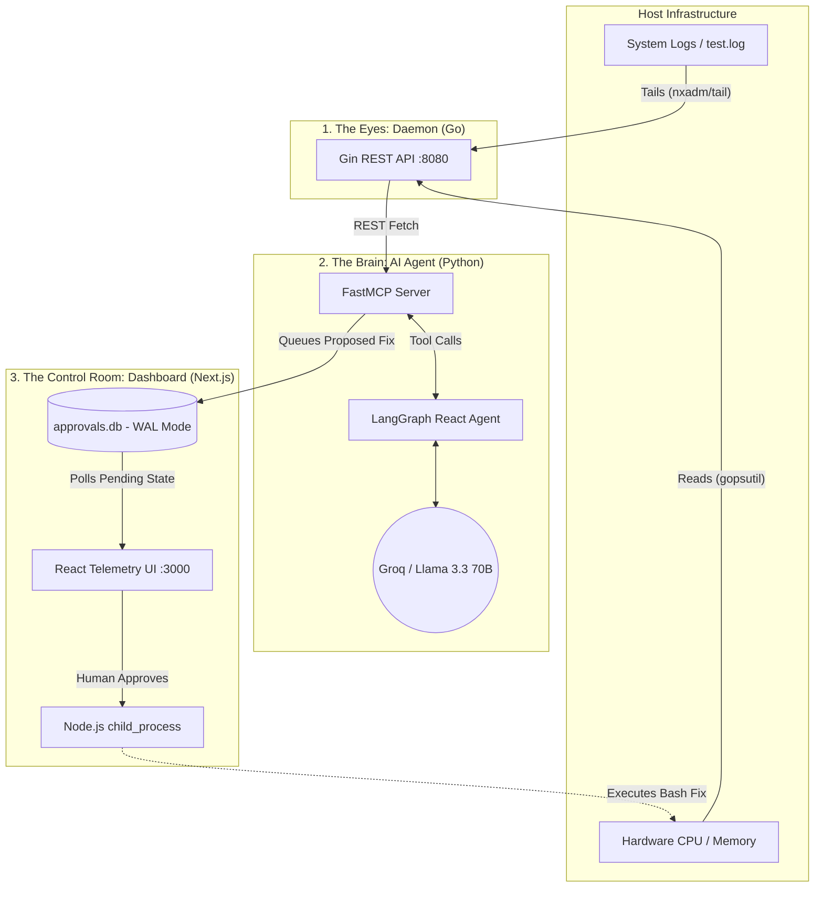

# 🛡️ Healer: Autonomous AI DevOps Monitoring System

**Healer** is an end-to-end, multi-language observability and remediation pipeline. It uses a lightweight Go daemon to monitor host telemetry, a LangGraph AI agent to autonomously diagnose infrastructure anomalies, and a Next.js control room for human-in-the-loop (HITL) execution of AI-proposed bash remediations.

## 🧠 System Architecture

✨ Core Features
Polyglot Microservices: Architected with Go (for high-performance system sensors), Python (for LangChain/AI orchestration), and TypeScript/Next.js (for the interactive frontend).

Autonomous Reasoning: Powered by LangGraph and Groq (Llama 3.3). The agent runs on a continuous loop, analyzing live hardware metrics and log buffers to detect anomalies.

Model Context Protocol (MCP): Uses the emerging MCP standard (FastMCP) to securely bridge the AI's reasoning engine with local system diagnostic tools.

Human-in-the-Loop Execution: The AI cannot alter the system directly. It queues secure bash commands in a SQLite database (WAL mode enabled for concurrent I/O), awaiting human authorization.

Live Telemetry Dashboard: A dark-mode, enterprise-grade Next.js UI utilizing Recharts for live CPU/Memory visualization and real-time intervention alerts.

Containerized: Fully orchestrated via docker-compose with anonymous volume mounting for native binding compatibility and host-level PID access for accurate hardware readings.

🚀 Getting Started
Prerequisites
Docker & Docker Compose (for containerized setup)

A free API key from Groq

Installation (Docker - Recommended)
Clone the repository and navigate to the root directory.

Create an environment file in the mcp-server directory:

Bash
echo "GROQ_API_KEY=your_api_key_here" > mcp-server/.env
Boot the entire microservice stack:

Bash
docker compose up --build
Open your browser to http://localhost:3000 to view the Control Room.

Installation (Local/Native)
If you prefer to run the services natively without Docker:

1. Start the Go Daemon:

Bash
cd daemon && go run main.go
2. Start the AI Agent:

Bash
cd mcp-server
pip install -r requirements.txt
python agent.py
3. Start the Next.js Dashboard:

Bash
cd dashboard
npm install && npm run dev
🧪 Testing the Autonomous Loop
To see the AI in action, simulate a system crash by injecting a critical error into the log file the Go daemon is tailing.

Open a new terminal and run:

Bash
echo "CRITICAL: Redis cache memory leak detected. Restart required." >> daemon/test.log
What happens next?

Within 30 seconds, the Python agent will detect the anomaly during its health check loop.

The LangGraph agent will formulate a safe remediation command (e.g., systemctl restart redis).

The Next.js dashboard will instantly flash a critical alert card containing the proposed fix.

Click "Execute Fix" to run the bash command on the host via Node's child_process.

⚠️ Security Disclaimer
This project is a portfolio prototype demonstrating autonomous AI workflows. The Next.js API route utilizes Node's exec() function to execute database-stored commands on the host machine. In a production environment, this represents a Remote Code Execution (RCE) risk. An enterprise deployment would replace this with a strict command allowlist or isolated sandboxed workers.
